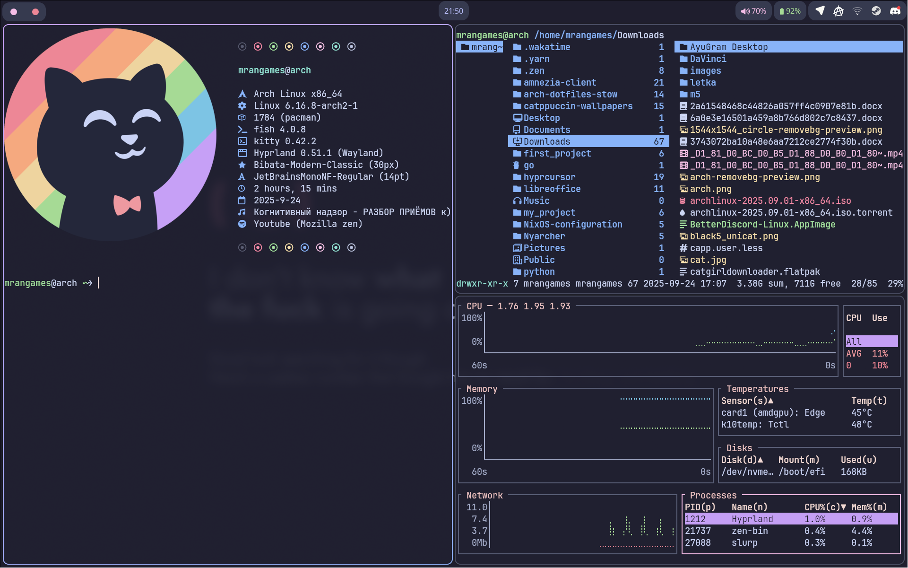
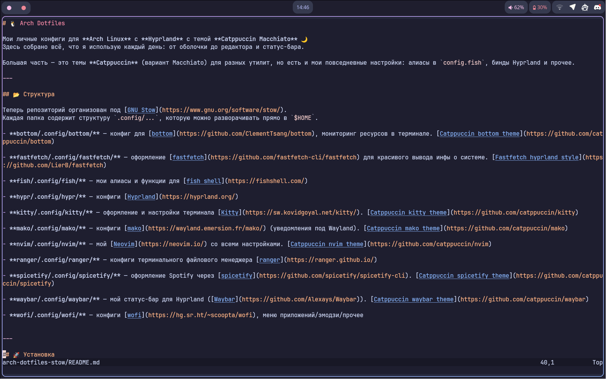

# 🐧 Arch Dotfiles

Мои личные конфиги для **Arch Linux** с **Hyprland** с темой **Catppuccin Macchiato** 🌙  
Здесь собрано всё, что я использую каждый день: от оболочки до редактора и статус-бара.

Большая часть — это темы **Catppuccin** (вариант Macchiato) для разных утилит, но есть и мои повседневные настройки: алиасы в `config.fish`, бинды Hyprland и прочее.

---

## 📂 Структура

Теперь репозиторий организован под [GNU Stow](https://www.gnu.org/software/stow/).  
Каждая папка содержит структуру `.config/...`, которую можно разворачивать прямо в `$HOME`.

- **bottom/.config/bottom/** — конфиг для [bottom](https://github.com/ClementTsang/bottom), мониторинг ресурсов в терминале. [Catppuccin bottom theme](https://github.com/catppuccin/bottom)
    
- **fastfetch/.config/fastfetch/** — оформление [fastfetch](https://github.com/fastfetch-cli/fastfetch) для красивого вывода инфы о системе. [Fastfetch hyprland style](https://github.com/LierB/fastfetch)
    
- **fish/.config/fish/** — мои алиасы и функции для [fish shell](https://fishshell.com/)
    
- **hypr/.config/hypr/** — конфиги [Hyprland](https://hyprland.org/)
    
- **kitty/.config/kitty/** — оформление и настройки терминала [Kitty](https://sw.kovidgoyal.net/kitty/). [Catppuccin kitty theme](https://github.com/catppuccin/kitty)
    
- **mako/.config/mako/** — конфиги [mako](https://wayland.emersion.fr/mako/) (уведомления под Wayland). [Catppuccin mako theme](https://github.com/catppuccin/mako)
    
- **nvim/.config/nvim/** — мой [Neovim](https://neovim.io/) со всеми настройками. [Catppuccin nvim theme](https://github.com/catppuccin/nvim)
    
- **ranger/.config/ranger/** — конфиги терминального файлового менеджера [ranger](https://ranger.github.io/)
    
- **spicetify/.config/spicetify/** — оформление Spotify через [spicetify](https://github.com/spicetify/spicetify-cli). [Catppuccin spicetify theme](https://github.com/catppuccin/spicetify)
    
- **waybar/.config/waybar/** — мой статус-бар для Hyprland ([Waybar](https://github.com/Alexays/Waybar)). [Catppuccin waybar theme](https://github.com/catppuccin/waybar)
    
- **wofi/.config/wofi/** — конфиги [wofi](https://hg.sr.ht/~scoopta/wofi), меню приложений/эмодзи/прочее
    

---

## 🚀 Установка

### Ручная установка

Просто скопируй нужные конфиги в соответствующие директории:

```bash
# fish
cp -r fish/.config/fish/* ~/.config/fish/

# kitty
cp -r kitty/.config/kitty/* ~/.config/kitty/

# waybar
cp -r waybar/.config/waybar/* ~/.config/waybar/
```

### Через GNU Stow (рекомендуется)

```bash
cd ~/arch-dotfiles-stow
stow fish
stow kitty
stow waybar
# или сразу все:
stow */
```

Удаление симлинков:

```bash
stow -D fish
```

---

## ✨ Используемые штуки

- **WM:** Hyprland
    
- **Bar:** Waybar
    
- **Menu:** Wofi
    
- **Shell:** Fish
    
- **Terminal:** Kitty
    
- **Editor:** Neovim
    
- **Theme:** Catppuccin (Macchiato)
    

---

## 📝 Фишки и изменения

- **Hyprfetch:** алиас из конфига fish, запускающий fastfetch с красивым конфигом (автозапуск при каждой сессии терминала)
    
- Убрано оповещение об обновлении Hyprland
    
- **Классические бинды Hyprland изменены:**
    
    - Открытие терминала на Mod+E
        
    - Закрытие окна на Mod+Q
        
    - Запуск Wofi на Mod+D
        

---

## 📸 Скриншоты

### Hyprfetch + Ranger + Bottom



### Neovim


### Wallpaper + Waybar


---

## 📜 Лицензия

Никаких лицензий. Только анархия 🏴
